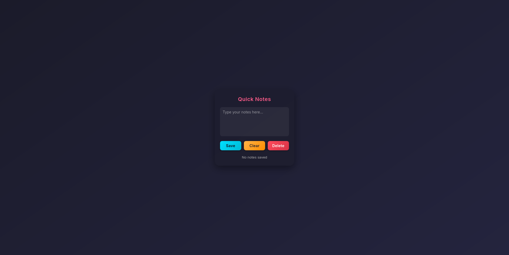

---
Quick Notes

## 🎮 What the Code Does
This code builds a **Notion-style note-saving extension** for your browser. It handles:

- 📝 Saving notes per tab (your secret thoughts are safe!)
- 🔄 Loading notes automatically when you switch tabs
- 🗑️ Deleting notes from the vault (poof!)
- ✨ Clearing the input box without deleting stored notes
- 🖱️ Button-based UI for Save, Clear, and Delete
- 💬 Status messages with funny, encouraging feedback
- 🕵️‍♂️ Automatically detecting the current tab URL

---

## Screenshot

## ✅ Key Features

| Feature | Description |
| --- | --- |
| **Tab-specific Notes** | Each browser tab has its own secret note vault |
| **Persistent Storage** | Notes survive browser restarts using `browser.storage.local` |
| **Automatic Loading** | Switch tabs or refresh, and your note pops up |
| **Status Messages** | Colorful, fun feedback for saving, loading, deleting, or clearing |
| **Button Controls** | Save, Clear, Delete – your magical commands |
| **Async Handling** | Uses `async/await` to make sure dragons finish loading notes before acting |
| **No Memory Overlap** | Each tab’s notes are independent (no cross-tab identity crises) |

---

## 🧮 Core Logic Concepts

| Concept | Used For |
| --- | --- |
| `document.addEventListener("DOMContentLoaded")` | Wait for the page to be ready before doing wizard stuff |
| `browser.storage.local` | The mystical vault where all notes live |
| `getCurrentTabURL()` | Figure out which tab is asking for a note |
| `async/await` | Make the code polite: “I’ll wait for you, dear browser” |
| DOM Manipulation | Show notes, clear notes, and update status messages dynamically |
| Functions (`loadNote`, `saveNote`, `deleteNote`) | Encapsulate behaviors for clarity and magic reuse |

---

## 🕹️ Input & Controls

- 📝 **Save Button** — Puts your note safely in the vault (dragons approve)
- ✨ **Clear Button** — Empties the text box but keeps the note in storage
- 🗑️ **Delete Button** — Obliterates the note from storage (poof! into the void)
- 🔄 **Tab Switch / Refresh** — Automatically reloads the note for the current tab
- 💬 **Status Messages** — Tells you what’s happening, with color-coded feedback:
    - 💚 Green = Saved successfully
    - 🔴 Red = Deleted note

---